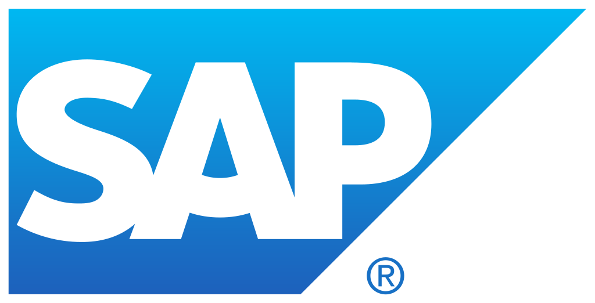

# Hi there 👋

**👯 I’m looking to collaborate on Microsoft + SAP integration projects**

All my content is grouped on the Ninja Cat 🥷🐱 [repos](https://martinpankraz.github.io/ninja-unicorn/) that I run with an amazing group of contributors.

Find my featured and recorded sessions on the SAP on Azure  Channel.

### 📫 How to reach me

 
 

Yours
Martin

